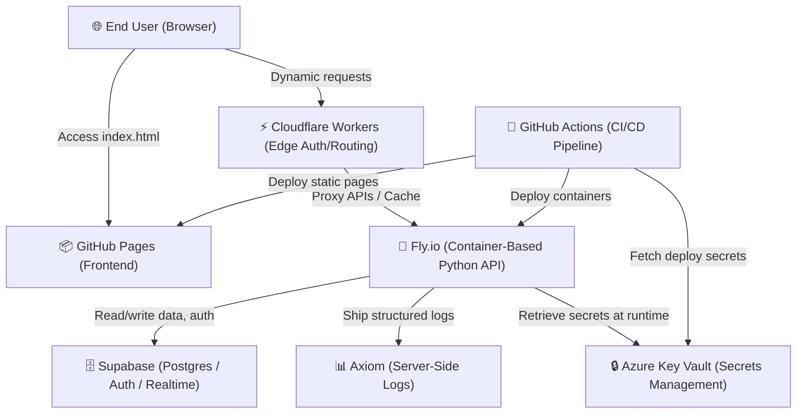

# 🏗️ System Architecture Overview

> **Stage 2 of 7 (Environment):** High-level system design, deployment layout, and component interaction.
> If the system architecture changes, developers and AI agents must update this document to keep it accurate.

---

## 🗺️ High-Level System Architecture

This project is built as a highly responsive, modern static application deployed on **GitHub Pages**, with routing handled by **Cloudflare Workers** (optional edge compute) and python APIs hosted on **Fly.io** backend.

---

## 🧩 Core Components

### 1. Frontend Static Layer (`index.html`)
- **Hosting:** Hosted directly at the root of the repository on GitHub Pages.
- **Styling & Assets:** Vanilla CSS styling, Fira Code / Outfit / Inter fonts, and FontAwesome icons loaded via CDN.
- **Routing:** Handled dynamically via `markdown_renderer.html` using query parameters (e.g. `?file=1_Real_Unknown/kanban.md`).
- **Menu System:**
  - **Project Menu:** Always visible, reads from `navigation_config.json`.
  - **Debug Menu:** Configured dynamically, toggled via a floating action button on the bottom right. Persists using cookie values (`debug=true`).
  - **Console Logger:** `debugLog` utility logs loading operations, API integrations, and routing info for developers if debug mode is active.

### 2. Edge Routing & Auth (`2_Environment/cloudflare_workers.md`)
- Cloudflare Workers act as a performant edge compute proxy.
- Provides rate-limiting, security headers, routing, and access control.

### 3. Backend Services (`2_Environment/fly_io.md`)
- **Container-based deployments:** Python services (FastAPI/Flask) run as Docker containers on Fly.io.
- Hosts vector database integration (Qdrant) and Ollama connections.

### 4. Database & Data Layer (`2_Environment/supabase.md`)
- **Provider:** Supabase (managed PostgreSQL).
- **Usage:** Primary database plus auth, auto-generated APIs, realtime subscriptions, storage, and `pgvector`. Accessed from the backend via `DATABASE_URL` / `supabase-py`, and optionally from the frontend via the anon key under Row Level Security.

### 5. Server-Side Logs (`2_Environment/axiom.md`)
- **Provider:** Axiom.
- **Usage:** Centralized, structured server-side logs from Fly.io and CI. Powers querying (APL), dashboards, and alerting.

### 6. Secrets Management (`2_Environment/setup_azure.md`)
- **Provider:** Microsoft Azure Key Vault.
- **Usage:** Stores all API keys, database credentials, and deployment keys. Secrets are loaded at runtime by backend environments or injected during CI/CD steps.

> 📋 For a single reference covering every tool in the stack, see [`tools.md`](./tools.md).

---

## 🛠️ How to Keep This Document Updated

1. **Keep Diagrams in Sync:** If new components are added (e.g. database layers, external OAuth providers), update the Mermaid graph above.
2. **Review Environment Configs:** Ensure that changes here match setup instructions in `setup_mac.md`, `setup_windows.md`, and `setup_ai.md`.
3. **Verify Rendering:** Ensure that Mermaid rendering works on the compiled web page via `markdown_renderer.html`.
