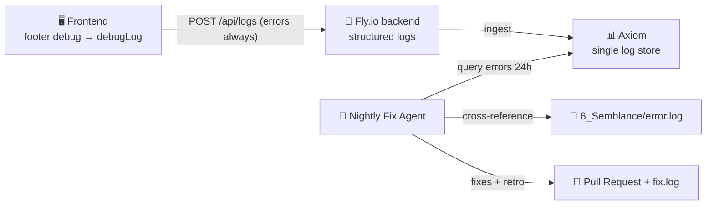

# 🪵 Formula — Unified Logging & Nightly Continuous-Fix

> **Stage 4 of 7 (Thinking & Planning):** The plan for how logs are captured on both ends and how errors get fixed automatically overnight. This document is the *recipe*; the implementation lives in `5_Symbols/`, the scars in `6_Semblance/`, and the proof in `7_Testing_Known/`.

---

## 🎯 Goal

One coherent logging story across the whole stack, plus a hands-off repair loop:

1. **Frontend** — capture logs through the existing **footer debug feature** (the bottom-right debug button + `debugLog` utility), and optionally forward them to the backend.
2. **Backend** — ship structured logs to **[Axiom](../2_Environment/axiom.md)** as the single source of truth for server-side events.
3. **Continuous Fix (nightly)** — a scheduled agent that, **when no one is actively coding**, queries Axiom + `6_Semblance/error.log`, finds errors, applies fixes, and opens a PR.

```
Browser (footer debug → debugLog) ──┐
                                    ├──► Axiom (single log store) ──► Nightly Fix Agent ──► PR + fix.log
Fly.io backend (structured logs) ───┘
```

---

## 1️⃣ Frontend Logs — The Footer Debug Feature

### What already exists
`index.html` and `markdown_renderer.html` ship a developer logging layer, gated by the `debug=true` cookie and toggled by the floating **debug button at the bottom-right** (`#debugToggle`):

```js
// getCookie() reads the debug flag; debugLog() only prints when debug mode is on
function debugLog(message, data = '') {
  if (getCookie("debug") === "true") {
    console.log(`%c[Debug Mode] ${message}`, 'color: #06b6d4; font-weight: bold;', data);
  }
}
```

Today this only writes to the browser console. The footer debug button flips `debug=true`, which makes `debugLog(...)` calls visible.

### The formula — extend `debugLog` into a real frontend log channel

Keep the existing behavior, but layer three capabilities on top (implement in `5_Symbols/`):

| Capability | How |
|------------|-----|
| **In-memory buffer** | Push every `debugLog` entry into a capped ring buffer (`window.__LOGS__`, last ~200 entries) so the footer panel can render a live log view, not just the console. |
| **Footer log panel** | Add a "Logs" tab inside the bottom-right debug overlay that renders the buffer (level, time, message, data). Visible only when `debug=true`. |
| **Global error capture** | Register `window.onerror` and `window.onunhandledrejection` to funnel uncaught errors through `debugLog("ERROR", ...)` so nothing is silently lost. |
| **Forward to backend** | When `debug=true` **or** severity is `ERROR`, POST batched entries to a backend endpoint (`/api/logs`) which re-emits them to Axiom. Frontend never holds the Axiom token — the backend is the only writer. |

### Log entry shape (frontend → backend)

```json
{
  "source": "frontend",
  "level": "info | warn | error",
  "message": "Dynamic navigation config loaded",
  "data": { "...": "..." },
  "path": "/index.html",
  "ts": "2026-06-19T22:00:00Z",
  "session": "anon-uuid"
}
```

### Rules
- The footer log panel and forwarding **only activate when `debug=true`**, except `error`-level events, which always forward (so production errors still reach Axiom).
- **Never** put the Axiom token in frontend code — forward through the backend (`/api/logs`).
- Don't log secrets, tokens, or PII from the browser.

---

## 2️⃣ Backend Logs — Axiom

The Fly.io Python backend is the **single writer to Axiom**. See [`2_Environment/axiom.md`](../2_Environment/axiom.md) for setup; the recipe here is *what* to log and *how* to structure it.

### What to log
- Every request: method, path, status, latency, `session`.
- Every handled error + full stack trace, tagged `level: "error"`.
- The `/api/logs` ingest from the frontend (re-emitted with `source: "frontend"`).
- Deploy/CI events (`fly deploy`, GitHub Actions) for post-mortems.

### Structured ingest (reference)
```python
# secrets come from Azure Key Vault → fly secrets; never hard-coded
log_event("error", "checkout failed",
          source="backend", path="/checkout",
          user_id=uid, trace=traceback.format_exc())
```

### Dataset convention
One Axiom dataset per environment: `delivery-pilot-dev | -staging | -prod`. The nightly fix agent reads from these.

### Tagging for the fix loop
Every error event must carry enough context for an agent to act:

| Field | Why the fix agent needs it |
|-------|----------------------------|
| `level` | Filter to `error` only |
| `message` | Human-readable symptom |
| `trace` | Stack trace → file + line to patch |
| `source` | `frontend` vs `backend` routes the fix |
| `path` / `route` | Reproduce the failing call |
| `release` / `commit` | Tie the error to a specific deploy |
| `count` (via APL) | Prioritize high-frequency errors |

---

## 3️⃣ Continuous Fix — Nightly Agent

A scheduled agent that runs **when no one is actively coding** (overnight), finds errors, fixes them, and leaves a reviewable PR by morning. Set it up with the `/schedule` skill (a cron-based cloud agent).

### Trigger & "not actively coding" guard
- **Schedule:** nightly, e.g. `0 3 * * *` (03:00 in the repo's timezone).
- **Idle guard:** the agent **aborts early** if the project looks active, to avoid colliding with a human:
  - Uncommitted changes in the working tree (`git status --porcelain` non-empty), **or**
  - A commit on `main` within the last N hours (default 6), **or**
  - An open PR labeled `wip`.
- If guarded out, it logs "skipped — active development" and exits.

### Nightly loop (per run)

```
1. Pull latest main.
2. Query Axiom (last 24h):
      ['delivery-pilot-prod']
      | where level == "error"
      | summarize count() by message, trace, source, path
      | sort by count_ desc
      | take 10
3. For each top error, cross-reference 6_Semblance/error.log:
      - new?  → append [DATE] [STAGE] [SEVERITY] — Description
      - known and VERIFIED? → skip
4. Diagnose from the trace → locate file:line in 5_Symbols/.
5. Apply the smallest safe fix on a branch: autofix/nightly-YYYY-MM-DD.
6. Run tests / build (/verify). If red, revert that fix and mark PENDING.
7. Log to 6_Semblance/fix.log:  [DATE] [STAGE] [APPLIED] — <fix>
8. Open ONE PR with all green fixes; never push straight to main.
9. Append a retrospective bullet to 6_Semblance/lessons_learned.md.
```

### Guardrails (must-haves)
- **Never auto-merge.** The agent opens a PR; a human merges. After merge + `7_Testing_Known` validation, fix status flips `APPLIED → VERIFIED`.
- **One concern per fix / commit** so review and revert stay easy.
- **Bounded scope:** only touch files implicated by a stack trace; no broad refactors.
- **Idempotent:** re-running the same night must not stack duplicate fixes (dedupe by error `message`+`trace` hash already in `error.log`).
- **Stop on ambiguity:** if a fix isn't obvious or tests can't confirm it, log the error + `[PENDING]` in `fix.log` and leave it for a human — don't guess.
- **Respect the gate:** the agent documents its reasoning in `llm_thinking_log.md` before editing `5_Symbols/`, same as any other contributor.

### Setup sketch (`/schedule`)
```
/schedule create nightly-autofix --cron "0 3 * * *" \
  --task "Run the nightly continuous-fix loop documented in
          4_Formula/logging_and_autofix.md §3. Abort if active development
          is detected. Open a PR; never auto-merge."
```
Secrets the agent needs (from Azure Key Vault): `AXIOM_TOKEN`, `AXIOM_DATASET`, plus repo write scope for the branch/PR.

---

## 🔁 How the Three Parts Connect



---

## ✅ Definition of Done

- [ ] `debugLog` buffers entries and the footer debug overlay shows a live **Logs** panel
- [ ] `window.onerror` / `onunhandledrejection` captured and forwarded
- [ ] Frontend errors reach Axiom via the backend `/api/logs` (no token in browser)
- [ ] Backend ships structured `error`-level events with `trace`, `source`, `path`, `commit`
- [ ] Nightly agent scheduled via `/schedule`, with the idle guard working
- [ ] Agent opens a PR (never auto-merges) and writes `error.log` + `fix.log` entries
- [ ] Retrospective appended to `6_Semblance/lessons_learned.md` after each run

> Implementation goes in `5_Symbols/`. Log the *why* in [`llm_thinking_log.md`](./llm_thinking_log.md) before coding. Validate in `7_Testing_Known/` and flip fixes to `VERIFIED`.
